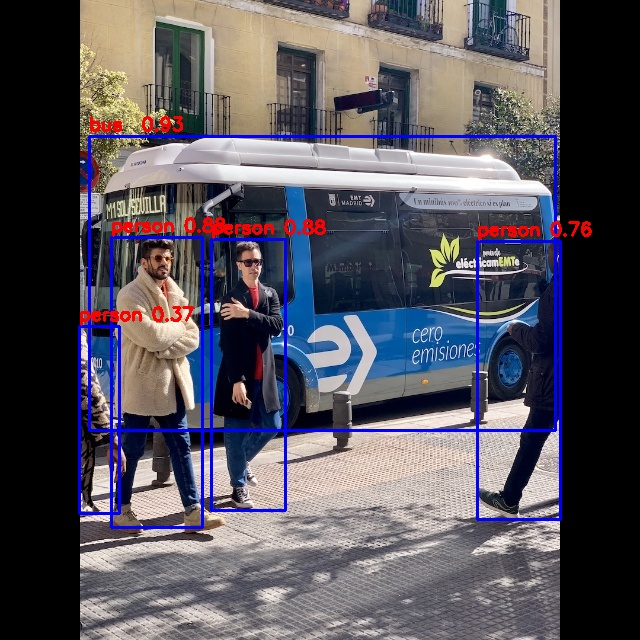

# How to use custom OP function

## Model Source
The model and YOLOX version used in this example come from the following open source project: https://github.com/airockchip/YOLOX

Yolox_s Download link: [yolox_s.onnx](https://ftrg.zbox.filez.com/v2/delivery/data/ec1c6f44f8c24155875ac5bce7aa6b3c/examples/yolox/yolox_s.onnx)

## Script Usage
*Usage:*
```
python test.py
```
*Description:*
- The default target platform in script is 'RK3588', please modify the 'target_platform' parameter of 'rknn.config()' according to the actual platform.

## Processes
The process of this example is as follows:
1. Edit the original ONNX model and save the custom ONNX model. Take Sigmoid OP as an example. Users can replace any OP with their own custom OP in ONNX model.
2. Init RKNN.
3. Register custom OP cstSigmoid.
4. Convert custom ONNX model to RKNN model.
5. Infer RKNN model in simulator.
6. Save the picture of results.
7. Release RKNN resource.

## Expected Results
1. Get an ONNX model named yolox_s_custom.onnx with cstSigmiod OP.
2. Get a RKNN model named yolox_s_custom.rknn.
3. Get a picture of detection results named result.jpg.


- Note: Different platforms, different versions of tools and drivers may have slightly different results.
