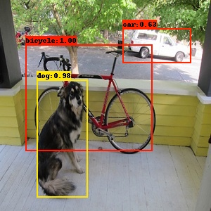

# How to use hybrid-quantization function

## Model Source
The model used in this example come from:  
https://github.com/tensorflow/models/blob/master/research/object_detection/g3doc/tf1_detection_zoo.md  ssd_mobilenet_v2_coco

## Script Usage
*Usage:*
```
1. python step1.py
2. modify ssd_mobilenet_v2.quantization.cfg according to the prompt of step1.py
3. python step2.py
```
*Description:*
- The default target platform in script is 'rk3566', please modify the 'target_platform' parameter of 'rknn.config' according to the actual platform.
- If connecting board is required, please add the 'target' parameter in 'rknn.init_runtime'.

## Expected Results
This example will outputs the results of the accuracy analysis and save the result of object detection to the 'result.jpg', as follows:  
```
layer_name                                                                                                            simulator_error                    
                                                                                                                  entire              single             
                                                                                                               cos      euc        cos      euc          
-----------------------------------------------------------------------------------------------------------------------------------------------------
[Input] FeatureExtractor/MobilenetV2/MobilenetV2/input:0                                                     1.00000 | 0.0       1.00000 | 0.0           
[exDataConvert] FeatureExtractor/MobilenetV2/MobilenetV2/input:0_int8                                        0.99996 | 2.0377    0.99996 | 2.0377        
[Conv] Conv__350:0                                                                                           
[Clip] FeatureExtractor/MobilenetV2/Conv/Relu6:0                                                             0.99998 | 9.5952    0.99998 | 9.5952        
[Conv] FeatureExtractor/MobilenetV2/expanded_conv/depthwise/BatchNorm/batchnorm/add_1:0                      
[Clip] FeatureExtractor/MobilenetV2/expanded_conv/depthwise/Relu6:0                                          0.99951 | 65.269    0.99957 | 61.673        

....

[Concat] concat:0_before_conv                                                                                0.99817 | 9.3381    1.00000 | 0.0317        
[exDataConvert] concat:0_before_conv__int8                                                                   0.99812 | 9.4634    0.99994 | 1.6116        
[Conv] concat:0_int8                                                                                         0.99812 | 9.4634    0.99994 | 1.6115        
[exDataConvert] concat:0                                                                                     0.99812 | 9.4634    0.99994 | 1.6115        
```

- Note: Different platforms, different versions of tools and drivers may have slightly different results.